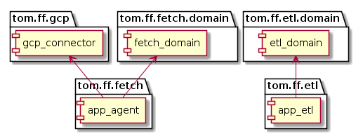

# Firefly - Custom Cloud ETL

## Introduction

Firefly is a little distributed app to load transactions from a custom configured cloud provider and load 
it to a local (or cloud) elastic instance. It is a demo app to demonstrate how this could be done.

## Design Goals

* Model the domain using the Algebraic Type System in scala
* Make the domain model serve as design documentation
* Make the design documentation compilable - so it doesnt get out-of-sync with the implementation
* Make the domain model readable by domain experts

## Architecture

components:


## Design

domain:


bounded contexts:


modules:


### Workflows:

fetch transactions:


run etl:


## Implementation Notes
* layers are io, service and domain
* io is infrastructure, REST api and serializers
* service is wired in beans that invoke workflows
* domain is types (domain model) and workflow implementations

### REST API

|EndPoint|POST|DELETE|GET|
|--------|----|------|---|
|/buckets|    |      |get all the bucket contents for that connector|
|/connectors|create a new connector|||


## Run
* On Linux (tested on Ubuntu 18.04.5 LTS)

```
cd backend
docker-compose up --build
```
## Develop
git clone https://github.com/tgeary90/firefly.git
